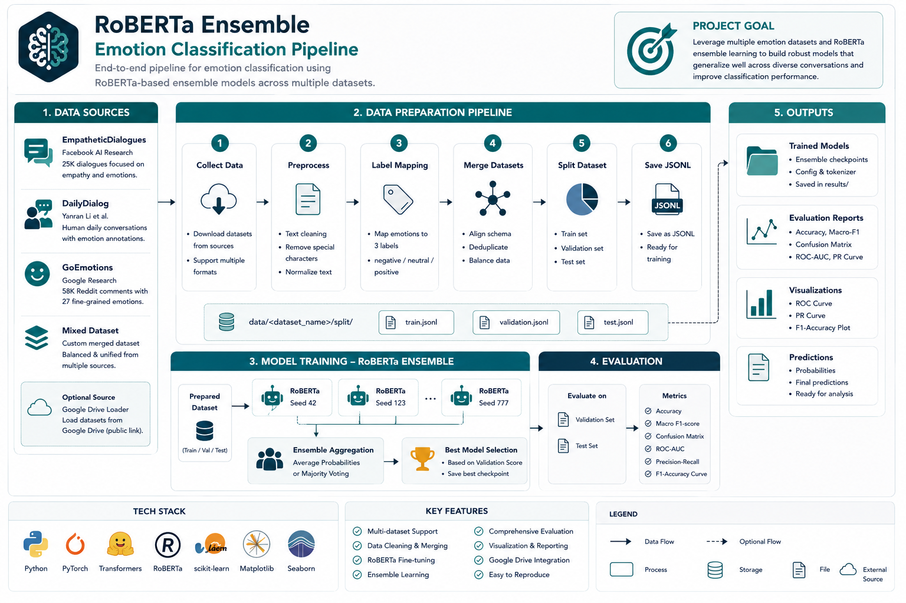

<<<<<<< HEAD
# llm-roberta-based-sentiment-classification-with-ensemble-approach

This project provides an end-to-end pipeline for emotion classification, including:
=======
# Social Sentiment Analysis : RoBERTa Ensemble Emotion Classification Pipeline
>>>>>>> 3fc8dfa (modify readme)

Built an end-to-end RoBERTa-based sentiment classification pipeline for social media text analytics.
- Data collection from multiple datasets
- Data preprocessing and merging
- Model training with ensemble approach
- Model evaluation

---
## 📁 Project Flow Structure



---
## 📦 Dataset

The project supports:

- "empathetic"
- "dailydialog"
- "goemotions"
- "mixed"

Datasets are processed into:

data/<dataset_name>/split/
- train.jsonl
- validation.jsonl
- test.jsonl

---

## ⚙️ Setup

### 1. Install dependencies

```bash
pip install -r requirements.txt
```

---

### 2. Environment Variables (Optional)

Create a `.env` file:

```env
GOOGLE_DRIVE_FOLDER_ID="Will assign by the owner"
```

---

default following dataset_link = ["dailydialog","empathetic","goemotions","mixed"]  # choose 1 to go

## 🚀 Usage

### 🔹 1. Pre-train (Full data pipeline)

Run data collection, preprocessing, and dataset preparation:

python main.py pre_train

### 🔹 2. Train

Train the model using prepared dataset:

python main.py train dataset_link<dataset_link>

Caution : You have to use cuda to run otherwise it will be very slow 

---

### 🔹 3. Evaluation

Evaluate the trained model.

#### ✔ Local model

python main.py eval --switch local --dataset_link <dataset_link>


#### ✔ Google Drive model / dataset
python main.py eval --switch google --dataset_link <dataset_link>


# Caution : put GOOGLE_DRIVE_FOLDER_ID in config.py instead of .env in order to pass the final. After the final I will use .env instead of config.py


---


## ☁️ Google Drive Integration

If using Google Drive:

- Ask owner for further use
- The script will download and cache locally


## 🧠 Model

- Training: `predict_model.py`
- Evaluation: `predict_evaluation.py`
- Models are saved in:

results/

---

## ⚠️ Notes

- Google Drive links must be public ("Anyone with the link")
- Large datasets will be downloaded locally
- Ensure `.env` is properly loaded if used

---

## 🛠️ Future Improvements

- Add logging system
- Support multiple model versions
- Add experiment tracking (e.g., MLflow)
- Improve dataset caching

---

## 📬 Contact

Feel free to open an issue for questions or improvements.

